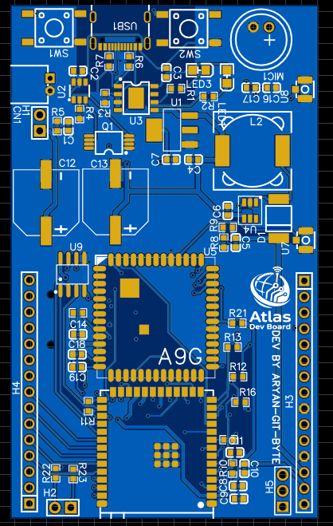
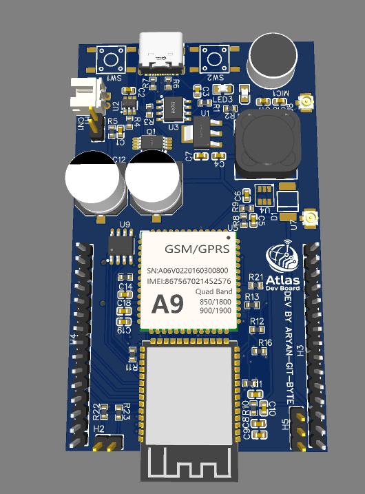
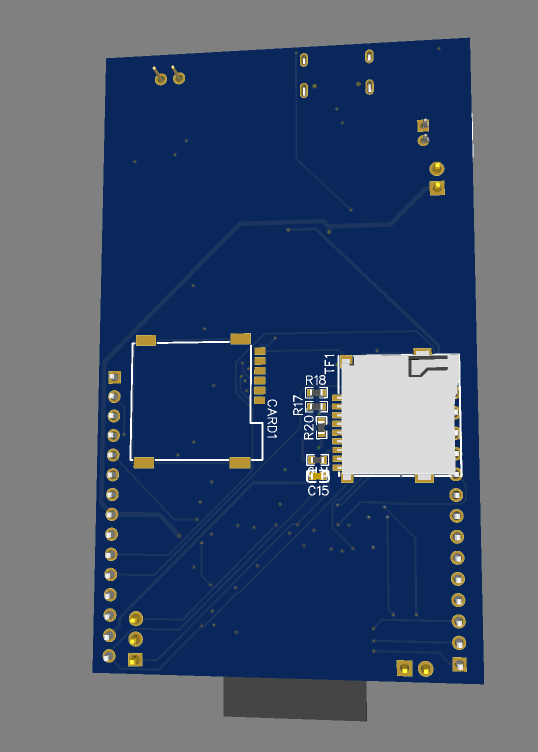
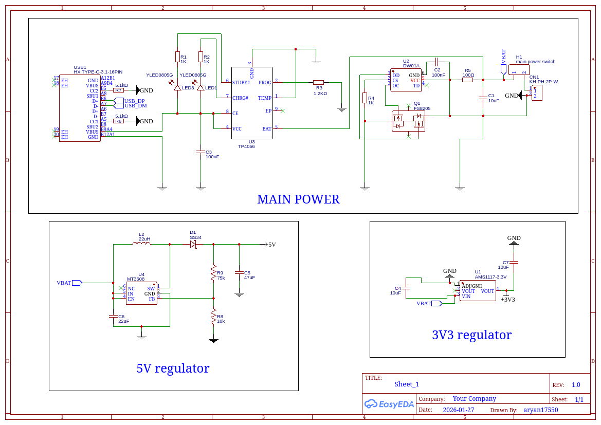
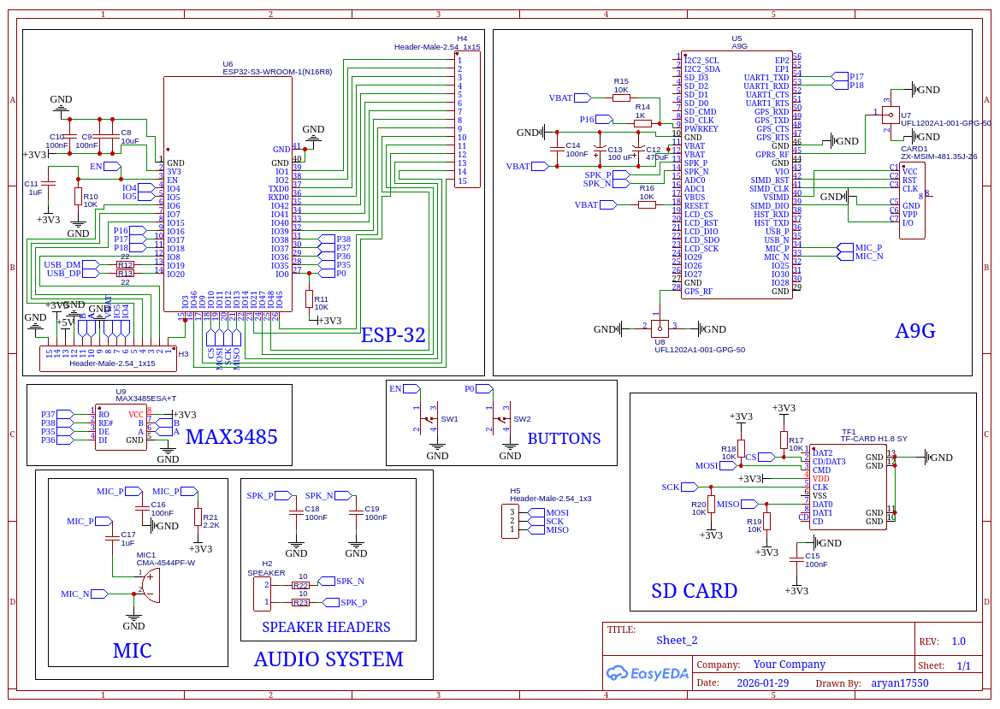

# Atlas DevBoar

## about the Board:
It is one of those perfect devboard i need for my projects, especically my IoTs one, and i was pretty tired of conecting different modules together, wiring em and all, SO i thought that why cant i make a board than fulfills my need, and this may even come handy for many other hackers/dev too. 
This board comprises of inbuilt BMS, GSM, GPRS, GPS, RS485 communication, mic, speaker, sd slots etc
with the main brain being esp32 s3 and A9G for gps/gprs/gsm.

## How to use it:

Its pretty simple can just upload the code in firmawre/ through the usb connector or power it through the jst, and just upload code , interact with other modules as describe in schematic and BOOM ur powerful devboard workingggg.
i will also try to make the complete datasheet very soon(probably after final exams ;D), 
some serial cmds to test the board:

`help or ?` - show command menu   
`status` - show system info   
`reboot` - restart system   
`sd.ls` - list files  
`sd.cat` <filename> - read file   
`sd.rm` <filename> - delete file  
`gsm.at` <command> - send AT command  
`gsm.rssi` - signal strength  
`gsm.sms` <number> <message> - send SMS   
`gps.on` - enable GPS   
`gps.off` - disable GPS   
`gps.loc` - get GPS location  
`485.tx` <message> - send data    
`pin.set` <pin> <0|1> - set pin state   
`pin.get` <pin> - read pin state  
`pwr.sleep` <seconds> - light sleep   
`pwr.vbat` - read battery voltage 

## Here are some cool images of the board:

 
 

## Schematic:

| Item name | Quantity | Unit Cost (₹) | Total (₹) | Link |
|-----------|----------|---------------|-----------|------|
| Capacitor 10uF 0603 SMD | 4 | 0.35 | 1.40 | https://robu.in/product/tcc0603x5r106m6r3ct-cctc-smt-ceramic-capacitors-0603-x5r-106m10%C2%B5f%C2%B120-rated-voltage6-30v-thickness0-80mm-tape/?gad_source=1&gad_campaignid=17427802703&gclid=CjwKCAiAv5bMBhAIEiwAqP9GuF-i6rxvy-S5Bo4Ykqe6bq8Rg3tK8av54tD5miIWAJzx13YKvTGnGBoCnE8QAvD_BwE |
| Capacitor 100nF 0603 SMD | 11 | 0.29 | 3.19 | https://robu.in/product/cl10b104kb8nnwc-samsang-50v-100nf-x7r-%C2%B110-0603-multilayer-ceramic-capacitors-mlcc-smd-smt-rohs/?gad_source=1&gad_campaignid=17427802703&gclid=CjwKCAiAv5bMBhAIEiwAqP9GuOr9DtmCmw4rtB-5OFyDbGd2g3SNHk_btxGLuyHqjueongNb3q_ACRoChZkQAvD_BwE |
| Capacitor 1uF 0603 SMD | 2 | 0.83 | 1.66 | https://robu.in/product/0603b105k500nt-fh-50v-1uf-x7r%C2%B110-0603-multilayer-ceramic-capacitors-mlcc-smd-smt-rohs/?gad_source=1&gad_campaignid=17427802703&gclid=CjwKCAiAv5bMBhAIEiwAqP9GuA0NO44HecZOWLN7lBWZTsOpKQP_OWXb4KmcTSKUqolr1n-ZnaZTahoCivkQAvD_BwE |
| Capacitor 47uF 0603 SMD | 1 | 26.00 | 26.00 | https://robu.in/product/jmk107bbj476ma-re-taiyo-yuden-cap-smd-mlcc-47uf-6-3v-0603-pack-of-1/ |
| Capacitor 22uF 0603 SMD | 1 | 0.80 | 0.80 | https://robu.in/product/0603x106m100nt-fh-10v-10uf-x5r%C2%B120-0603-multilayer-ceramic-capacitors-mlcc-smd-smt-rohs/?gad_source=1&gad_campaignid=17427802703&gclid=CjwKCAiAv5bMBhAIEiwAqP9GuChVyWRZ9K04EWZGNtFqKlXQdDlvyqFS_ox4U1NvxRgazF0DTxus1hoC24QQAvD_BwE |
| Capacitor 470uF Electrolytic SMD | 1 | 15.00 | 15.00 | https://robu.in/product/1-month-warranty-1286/?gad_source=1&gad_campaignid=17427802703&gclid=CjwKCAiAv5bMBhAIEiwAqP9GuDCabQB9Yj7Vy-9xer4Pff8cnOnRGmWZFzgX4NyhXXnApoxfJMUmExoCBL0QAvD_BwE |
| Capacitor 100uF Electrolytic SMD | 1 | 9.00 | 9.00 | https://robu.in/product/efvh050ada101m10b0-follon-100uf-50v-%C2%B120-smdd10xl10-5mm-aluminum-electrolytic-capacitors-smd-rohs/?gad_source=1&gad_campaignid=17427802703&gclid=CjwKCAiAv5bMBhAIEiwAqP9GuH7Mz-2yQ0-fZCEn_YBxU5bQ_pWCnQrDBor5o4uFcSEMbY_-LWa35hoCoFwQAvD_BwE |
| Resistor 1K 0603 SMD | 5 | 0.14 | 0.70 | https://robu.in/product/ac0603jr-071kl-yageo-res-thick-film-0603-1k-ohm-5-0-1w1-10w-%C2%B1100ppm-c-pad-smd-t-r-automotive-aec-q200/?gad_source=1&gad_campaignid=17427802703&gclid=CjwKCAiAv5bMBhAIEiwAqP9GuFXht7xTj8yB9wtwR-_aeGNYRdAfofHHwVzGuKVXeqJsaKXK6sk07RoCV9cQAvD_BwE |
| Resistor 10K 0603 SMD | 8 | 0.48 | 3.84 | https://robu.in/product/yageo-10k-ohm-1-4w-0603-surface-mount-chip-resistor-pack-of-50/?gad_source=1&gad_campaignid=17427802703&gclid=CjwKCAiAv5bMBhAIEiwAqP9GuEydSseXGA8a4FqmdWGQcz5DL41p2PomRyAB8AUZdsRHeFTxVgWC5xoCxBMQAvD_BwE |
| Resistor 1.2K 0603 SMD | 1 | 0.50 | 0.50 | https://robu.in/product/crcw06031k20fkea-vishay-smd-chip-resistor-1-2-kohm-%C2%B1-1-100-mw-0603-1608-metric-thick-film-general-purpose/?gad_source=1&gad_campaignid=17427802703&gclid=CjwKCAiAv5bMBhAIEiwAqP9GuAM3-F6tmT5i03Po6QC3YpZaIeMYHbVxeNKD_uElqG0a5HMaGwptshoCDgMQAvD_BwE |
| Resistor 100Ω 0603 SMD | 1 | 0.63 | 0.63 | https://robu.in/product/rc0603fr-0710rl-yageo-smd-chip-resistor-10-ohm-%C2%B1-1-100-mw-0603-1608-metric-thick-film-general-purpose/?gad_source=1&gad_campaignid=17427802703&gclid=CjwKCAiAv5bMBhAIEiwAqP9GuO0KJDkmSkYWycaqjlH6PmC7X_RXJCgGWMl1FBP9zDNp5QiZyXh-iRoCmbkQAvD_BwE |
| Resistor 5.1K 0603 SMD | 2 | 0.14 | 0.28 | https://robu.in/product/rc0603jr-075k1l-yageo-res-thick-film-0603-5-1k-ohm-5-0-1w1-10w-%C2%B1100ppm-c-pad-smd-t-r/?gad_source=1&gad_campaignid=17427802703&gclid=CjwKCAiAv5bMBhAIEiwAqP9GuBjByNZBIDbDPa1nc9lZWCf0uBR94cSmIyp_HX4scDPDPOTILYD9ihoC1jIQAvD_BwE |
| Resistor 75K 0603 SMD | 1 | 0.15 | 0.15 | https://robu.in/product/ac0603fr-0775kl-yageo-res-thick-film-0603-75k-ohm-1-0-1w1-10w-%C2%B1100ppm-c-pad-smd-t-r-automotive-aec-q200/?gad_source=1&gad_campaignid=17427802703&gclid=CjwKCAiAv5bMBhAIEiwAqP9GuJ2vAUrXUKN6S7E9IAo34b7yRx_rHpQPzxqO-AmfhWYI5UuCEi3zzRoCR2YQAvD_BwE |
| Resistor 22Ω 0603 SMD | 2 | 1.16 | 2.32 | https://robu.in/product/rc0603fr-7w22rl-yageo-smd-chip-resistor-22-ohm-%C2%B1-1-200-mw-0603-1608-metric-thick-film-general-purpose/?gad_source=1&gad_campaignid=17427802703&gclid=CjwKCAiAv5bMBhAIEiwAqP9GuCTmPxdPwLpo53ICluFrvu1AUwdud7s66zXpfKOZPi-9TW-utzfKqBoCJ9QQAvD_BwE |
| Resistor 2.2K 0603 SMD | 1 | 0.12 | 0.12 | https://robu.in/product/ac0603jr-072k2l-yageo-res-thick-film-0603-2-2k-ohm-5-0-1w1-10w-%C2%B1100ppm-c-pad-smd-t-r-automotive-aec-q200/?gad_source=1&gad_campaignid=17427802703&gclid=CjwKCAiAv5bMBhAIEiwAqP9GuLTWvsVQmLhUTSTggk_3QVocs1r-QvhLLG1mt9oX_FtR02Hbk76RyRoCWlIQAvD_BwE |
| Resistor 10Ω 0603 SMD | 2 | 1.56 | 3.12 | https://robu.in/product/rt0603brd0710kl-yageo-res-thin-film-0603-10k-ohm-0-1-0-1w1-10w-%C2%B125ppm-c-pad-smd-t-r/?gad_source=1&gad_campaignid=17427802703&gclid=CjwKCAiAv5bMBhAIEiwAqP9GuCdnJnly1IpwDqIGa04KkOuENI_kY_pG-5bLONPXgolacEbs-Hx7jBoCwAQQAvD_BwE |
| USB TYPE-C 3.1 16 PIN | 1 | 38.00 | 38.00 | https://robu.in/product/type-c-31-m-12-hroparts-5a-1-16p-female-type-c-smd-usb-connectors-rohs/ |
| ESP32-S3-WROOM-1 N16R8 Module | 1 | 367.00 | 367.00 | https://robu.in/product/espressif-esp32-wroom-32e-n16-module/?gad_source=1&gad_campaignid=17413441824&gclid=CjwKCAiAv5bMBhAIEiwAqP9GuFFtukshFuj8zmDOsadCES2A5rLQ1vcUes1r7ojZ2MNeAR45VA02BxoCjsYQAvD_BwE |
| A9G GSM/GPRS/GPS Module | 1 | 650.00 | 650.00 | https://aerokartindia.in/product/ai-thinker-a9g-gprs-series-module/?srsltid=AfmBOoprVJgg3dNBCt0HipayflhrphwPdQDOAKkFIU50p44QuJhKxL16HGY |
| AMS1117-3.3V Voltage Regulator SOT-223 | 1 | 3.85 | 3.85 | https://robu.in/product/ams1117-adj-slkor-sot-223-3-voltage-regulators-linear-low-drop-out-ldo-regulators-rohs/?gad_source=1&gad_campaignid=17427802703&gclid=CjwKCAiAv5bMBhAIEiwAqP9GuHlAQHNUg3kokfaA8G3TWRuy1Mp9KUO8jHYizzWzzhPQ-CfEx9iqEBoCF00QAvD_BwE |
| TP4056 Li-ion Battery Charger ESOP-8 | 1 | 9.00 | 9.00 | https://robu.in/product/1-month-warranty-1253/ |
| DW01A Battery Protection IC | 1 | 4.00 | 4.00 | https://quartzcomponents.com/products/dw01a-lithium-ion-lithium-polymer-battery-protection-ic-sot-23-6-smd-package?variant=45090775204074&country=IN&currency=INR&utm_medium=product_sync&utm_source=google&utm_content=sag_organic&utm_campaign=sag_organic?utm_source=google&utm_medium=FreeListings&srsltid=AfmBOopaqM265KrUQFpDHvNtoSQa2BhEQrTrn3hdV7jEZ7i18wJSniKExfQ |
| MT3608 Step-Up Converter | 1 | 11.00 | 11.00 | https://robu.in/product/mt3608-xian-aerosemi-tech-boost-type-adjustable-2a-2v24v-sot-23-6-dc-dc-converters-rohs/ |
| MAX3485 RS485 Transceiver SOIC-8 | 1 | 168.00 | 168.00 | https://robu.in/product/max3485eesa-analog-devices-3-3v-powered-%C2%B1-15kv-esd-protected-12mbps-slew-rate-limited-rs485-rs-422-transceivers-soic-8/ |
| FS8205 Dual MOSFET | 1 | 8.00 | 8.00 | https://robu.in/product/1-month-warranty-398/?gad_source=1&gad_campaignid=17427802703&gclid=CjwKCAiAv5bMBhAIEiwAqP9GuIuML7BN0w_jDT6QmL7ugNt_h8NkfGIV5BZSm9JpEVh8MK2dsnADUhoCRlsQAvD_BwE |
| SS34 Schottky Diode | 1 | 7.00 | 7.00 | https://robu.in/product/ss34-schottky-diode-for-high-speed-switching-pack-of-2/?gad_source=1&gad_campaignid=17427802703&gclid=CjwKCAiAv5bMBhAIEiwAqP9GuLWhPwrGHH92dlciFxBaf1ix2RbOX0O3zA94afv8m0EymdX29FGlmxoCTL8QAvD_BwE |
| Inductor 22uH SMD | 1 | 17.00 | 17.00 | https://robu.in/product/cdrh104r-22%CE%BCh-power-inductor-pack-of-5/?gad_source=1&gad_campaignid=17427802703&gclid=CjwKCAiAv5bMBhAIEiwAqP9GuHsK98qvfMbNh0ODbK1WPMG2ozo2O_z8W29kgH5hjRC0Ifril2CMexoClIEQAvD_BwE |
| LED green 0805 SMD | 1 | 2.60 | 2.60 | https://robu.in/product/0805-surface-mount-led-green-50-pcs/?gad_source=1&gad_campaignid=17427802703&gclid=CjwKCAiAv5bMBhAIEiwAqP9GuIpaxWBGkndqGxMCrWKsnj8ULXfb1GgGiieeVz_fHLIhr7T3xfuTQBoC8RgQAvD_BwE |
| LED yellow 0805 SMD | 1 | 1.00 | 1.00 | https://robu.in/product/0805-surface-mount-led-yellow/?gad_source=1&gad_campaignid=17427802703&gclid=CjwKCAiAv5bMBhAIEiwAqP9GuFOVnFYb7ktgB1u9TDsnDY6w1bv-r-s2JqnV1oMtvUK17TXiBTL7HBoCbVkQAvD_BwE |
| Tactile Switch 6x6x7.3mm SMD | 2 | 1.00 | 2.00 | https://robu.in/product/kfc-a06-7-0-tact-switch-4pin6x6x7/?gad_source=1&gad_campaignid=17427802703&gclid=CjwKCAiAv5bMBhAIEiwAqP9GuCPznQsPiuJwFQgFKTQ2NJJ32UAZTgZmGzSQYNolonDwWFvvpytJSRoCbZkQAvD_BwE |
| SD Card Slot TF Card | 1 | 41.00 | 41.00 | https://robu.in/product/thd2528-11sd-gf-thd-2mm-connector-and-ejector-microsd-card-tf-card-push-push-smd-sd-card-memory-card-connector-rohs/?gad_source=1&gad_campaignid=17427802703&gclid=CjwKCAiAv5bMBhAIEiwAqP9GuDb6-6fHtpEgRKLrxjRJ1PIW2S8AmVhKXE4-iBabR38PIQqGJXUaQxoCLDUQAvD_BwE |
| SIM Card Slot | 1 | 41.00 | 41.00 | https://robu.in/product/thd2528-11sd-gf-thd-2mm-connector-and-ejector-microsd-card-tf-card-push-push-smd-sd-card-memory-card-connector-rohs/ |
| IPEX Antenna Connector | 2 | 24.00 | 48.00 | https://robu.in/product/ufl-ipex-mhf1-rf-connector/?gad_source=1&gad_campaignid=17427802703&gclid=CjwKCAiAv5bMBhAIEiwAqP9GuJQeE3bo5GWZwqhbEcxRPmoZUEYn2olZIdPal1jw2XcRlcSIwyBUDRoCJLEQAvD_BwE |
| Microphone CMA-4544PF-W | 1 | 55.00 | 55.00 | https://robu.in/product/microphone-97mm-pack-of-3/ |
| Header 2.54mm Male | 2 | 11.00 | 22.00 | https://robu.in/product/2-54mm-1x40-pin-male-single-row-straight-long-header-strip-pack-of-3/?gad_source=1&gad_campaignid=17427802703&gclid=CjwKCAiAv5bMBhAIEiwAqP9GuIiVEHAMhBR2Ht9I5auW85Rl5HYRWfnNjZ2AK4eGe-6DSZ5G5ksLmxoCQeYQAvD_BwE |
| 2P Battery Connector 2.00mm | 1 | 14.00 | 14.00 | https://robu.in/product/s2b-xh-alfsn-jst-1x2p-2p-xh-tin-2-25%E2%84%8385%E2%84%83-3a-1-2-5mm-brass-bend-insert-push-pullp2-5mm-wire-to-board-connector-rohs/?gad_source=1&gad_campaignid=17427802703&gclid=CjwKCAiAv5bMBhAIEiwAqP9GuNGof2GnprUKj0MFyOCbIIdHB_Goa6iDXlFKLIfhehZBrpr-0kFuTBoCiXoQAvD_BwE |
| **TOTAL** | | | **₹1,578.16** | |

## GG, let me know if anything's left out
