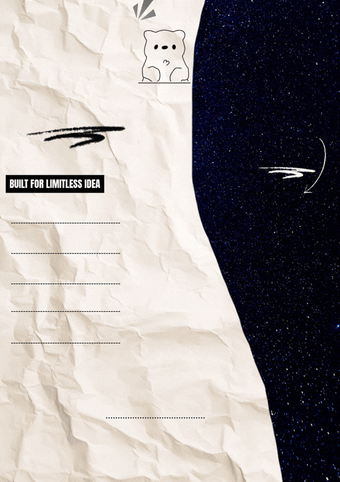
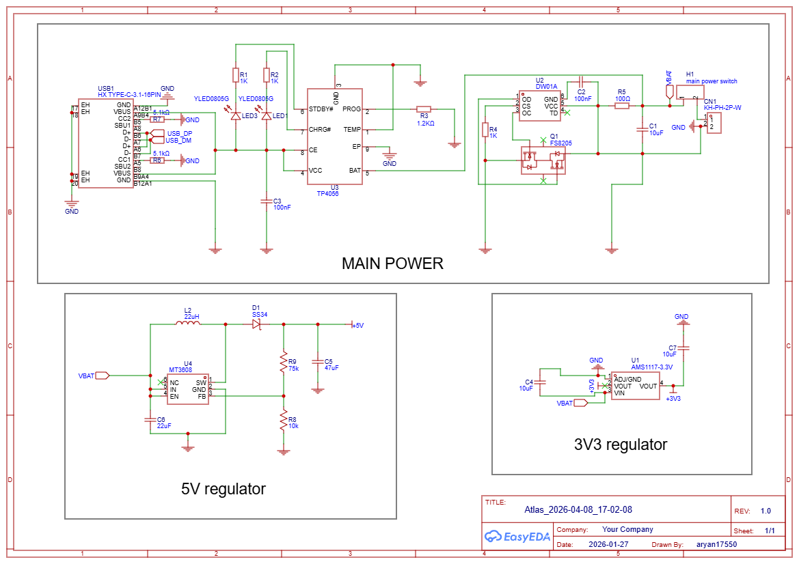
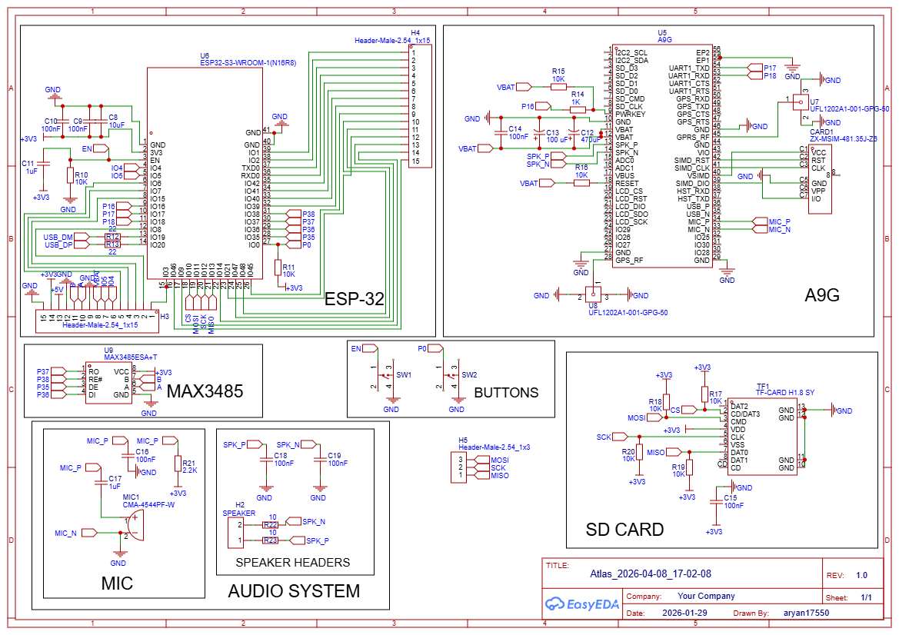
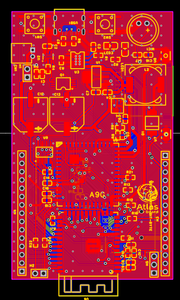
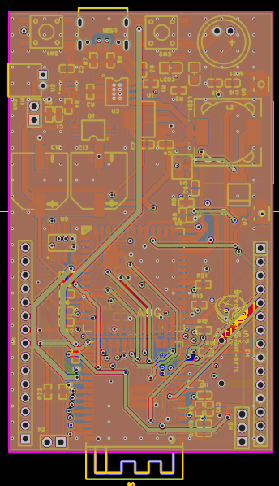
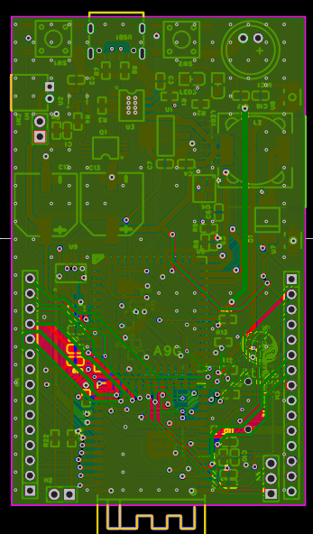
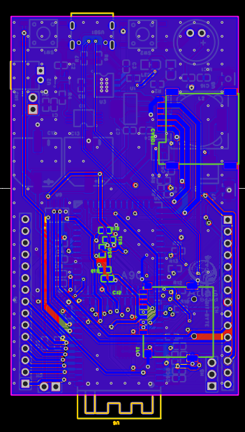
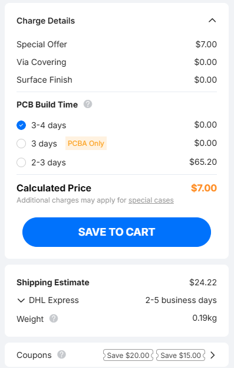

# Atlas DevBoard
# Overview:

## about the Board:
It is one of those perfect devboard i need for my projects, especically my IoTs one, and i was pretty tired of conecting different modules together, wiring em and all, SO i thought that why cant i make a board that fulfills my need, and this may even come handy for many other hackers/dev too. 
This board comprises of inbuilt BMS, GSM, GPRS, GPS, RS485 communication, mic, speaker, sd slots etc
with the main brain being esp32 s3 and A9G for gps/gprs/gsm.
## Application:
lots of IoT projects u can think of
plus normal projects too that needs lot of flash or eeprom

## How to use it:
Its pretty simple, you can just upload the code in firmawre/ through the usb connector or power it through the jst, and just upload code , interact with other modules as describe in schematic and BOOM ur powerful devboard workingggg., 
some serial cmds to test the board:

`help or ?` - show command menu   
`status` - show system info   
`reboot` - restart system   
`sd.ls` - list files  
`sd.cat` <filename> - read file   
`sd.rm` <filename> - delete file  
`gsm.at` <command> - send AT command  
`gsm.rssi` - signal strength  
`gsm.sms` <number> <message> - send SMS   
`gps.on` - enable GPS   
`gps.off` - disable GPS   
`gps.loc` - get GPS location  
`485.tx` <message> - send data    
`pin.set` <pin> <0|1> - set pin state   
`pin.get` <pin> - read pin state  
`pwr.sleep` <seconds> - light sleep   
`pwr.vbat` - read battery voltage 

# Schematic Overview:

This page contains the whole power system of the board starting off we have the usb-C connector for both charging and coding, then we have BMS, a 5v Boost converter and a 3v3 linear regulator

after that we have, 

this page does the heavy work, with the first u can see the esp32-block along with its peripherals and the breakout connectors. after that we have A9G with its peripherals . and so with the max3485, buttons, jumpers, sd card, mic , speakers etc
# PCB overview:

# BOM:
## Quartz Components/ Robu / Aero kart india:

| Item name | Quantity | Unit Cost (₹) | Link  |Total (₹) |
|-----------|----------|---------------|-------|---------|
100 nF Capacitor 0603 (pack of 20)|1|11 rs | [link](https://quartzcomponents.com/products/kemet-100nf-50v-0603-smd-pack-x7r-multilayer-ceramic-capacitor-10-tolerence-pack-of-20?variant=45972486193386&country=IN&currency=INR&utm_medium=product_sync&utm_source=google&utm_content=sag_organic&utm_campaign=sag_organic&srsltid=AfmBOopnfKv3gKdibyX3qxzEoiDa6hgtUaGOK5H7Lh-MDVl_BFFMZAF-OTY)| 11 rs
 10 uf Capacitor 0603 (pack of 20)|1|21 rs | [link](http://quartzcomponents.com/products/kemet-10uf-50v-0603-smd-pack-x5r-multilayer-ceramic-capacitor-20-tolerence-pack-of-20?variant=45972488650986&country=IN&currency=INR&utm_medium=product_sync&utm_source=google&utm_content=sag_organic&utm_campaign=sag_organic&srsltid=AfmBOormQjJdVIfUPm8Jzy_H09CPX3UB9iPiFBMJn146FeXnQVx0CRSwGLQ)|21 rs
 1 uf Capacitor 0603 (pack of 20)|1 | 15 rs |[link](https://quartzcomponents.com/products/kemet-1uf-50v-0603-smd-pack-x5r-multilayer-ceramic-capacitor-20-tolerence-pack-of-20?variant=45972488618218&country=IN&currency=INR&utm_medium=product_sync&utm_source=google&utm_content=sag_organic&utm_campaign=sag_organic&srsltid=AfmBOoodm79gzi-zqNkVgIbF4FZf7b6woSnsmceA7LnPTW8xGegxe5R3Pns)|15 rs
 470 uF electrolytic capacitor SMD | 1 | 11 rs|[link](https://quartzcomponents.com/products/470uf-16v-smd-electrolytic-capacitor?variant=44687016198378&country=IN&currency=INR&utm_medium=product_sync&utm_source=google&utm_content=sag_organic&utm_campaign=sag_organic&srsltid=AfmBOoo1qnhF7xqrfm20LRN1f3cxOEsIv1kXltBlRScw_uugCixvfBv1LBU)|11 rs
 100 uF electrolytic capacitor SMD | 1 | 7 rs | [link](https://quartzcomponents.com/products/100uf-35v-smd-electrolytic-capacitor?variant=44686980612330&country=IN&currency=INR&utm_medium=product_sync&utm_source=google&utm_content=sag_organic&utm_campaign=sag_organic&srsltid=AfmBOopRpYsIrRTNkJwJFE-qxznmR0F21zJkkX88dSpECcPY746rEjhJZ18)|7 rs
   1k resistor 0603 (pack of 20)|1|8 rs | [link](https://quartzcomponents.com/products/1k-ohm-0603-package-1-10w-smd-resistor-5-tolerance-pack-of-20-pieces?variant=44678124044522&country=IN&currency=INR&utm_medium=product_sync&utm_source=google&utm_content=sag_organic&utm_campaign=sag_organic&srsltid=AfmBOooTZUS1zsB4f3PE5dWbeMA6i-khZqG8HhMp-ZGxgsbvsS7hYUcOOro)| 8 rs
10K resistor 0603 (pack of 20)|1|9 rs |[link](https://quartzcomponents.com/products/yageo-10k-ohm-0603-package-1-10w-smd-resistor-1-tolerance-pack-of-20-pieces?variant=45952340623594&country=IN&currency=INR&utm_medium=product_sync&utm_source=google&utm_content=sag_organic&utm_campaign=sag_organic&srsltid=AfmBOop3qqJtrJQFl8tLjY1rHIezBc7-mGV0Q7ZtnD6Ue6rfLTnygAlYDqg)| 9 rs
1.2k resistor 0603 (pack of 20)|1|8 rs | [link](https://quartzcomponents.com/products/1-2k-ohm-0603-package-1-10w-smd-resistor-5-tolerance-pack-of-20-pieces?variant=44677795971306&country=IN&currency=INR&utm_medium=product_sync&utm_source=google&utm_content=sag_organic&utm_campaign=sag_organic&srsltid=AfmBOoqCzmcPi8RWpmCdTY6m1ArLwkAM38tK01N18EkXct6kPDtXUde1lPQ)|8 rs 
100Ω resistor 0603 (pack of 20)|1|9 rs | [link](http://quartzcomponents.com/products/yageo-100-ohm-0603-package-1-10w-smd-resistor-1-tolerance-pack-of-20-pieces?variant=45952333578474&country=IN&currency=INR&utm_medium=product_sync&utm_source=google&utm_content=sag_organic&utm_campaign=sag_organic&srsltid=AfmBOopiorQMJMH0dD5hcQRUIVfxJ6WvwUaRMObZnqLVLO1lfMPZVC1F0EE)|9 rs 
 5.1k resistor 0603 (pack of 20)|1|6 rs | [link](https://quartzcomponents.com/products/yageo-5-1k-ohm-0603-package-1-10w-smd-resistor-1-tolerance-pack-of-20-pieces?variant=45985100988650&country=IN&currency=INR&utm_medium=product_sync&utm_source=google&utm_content=sag_organic&utm_campaign=sag_organic&srsltid=AfmBOorH8L1eFtB1-geEdVXaVFxpQT2Zs7EzmjMSqO0NkfrEaKZ44usU9sg)| 6 rs
 75K resistor 0603 (pack of 20)|1|9 rs |[link](https://quartzcomponents.com/products/yageo-100-ohm-0603-package-1-10w-smd-resistor-1-tolerance-pack-of-20-pieces?variant=45952333578474&country=IN&currency=INR&utm_medium=product_sync&utm_source=google&utm_content=sag_organic&utm_campaign=sag_organic&srsltid=AfmBOopiorQMJMH0dD5hcQRUIVfxJ6WvwUaRMObZnqLVLO1lfMPZVC1F0EE)| 9 rs
 22Ω 0603 resistor (pack of 20)|1 | 5 rs | [link](https://quartzcomponents.com/products/yageo-22-ohm-0603-package-1-10w-smd-resistor-5-tolerance-pack-of-20-pieces?variant=45984045826282&country=IN&currency=INR&utm_medium=product_sync&utm_source=google&utm_content=sag_organic&utm_campaign=sag_organic&srsltid=AfmBOoqNPiuY_PDdXFiXSDx8KOJn5hZ02Iavzdcj-pRuffzPIcdEvBVQOoI)|5 rs 
 2.2K 0603 resistor (pack of 20)|1 | 8 rs |[link](https://quartzcomponents.com/products/2-2k-ohm-0603-package-1-10w-smd-resistor-5-tolerance-pack-of-20-pieces?variant=44678124503274&country=IN&currency=INR&utm_medium=product_sync&utm_source=google&utm_content=sag_organic&utm_campaign=sag_organic&srsltid=AfmBOorMf9MVhEJ4brYGQ_NgPtpd3Fa4F0yGLzFaSKFHaoVyQLUmVOA5hQU)| 8 rs
 10Ω 0603 resistor (pack of 20)|1 |11 rs | [link](https://quartzcomponents.com/products/yageo-10-ohm-0603-package-1-10w-smd-resistor-1-tolerance-pack-of-20-pieces?variant=45952331022570&country=IN&currency=INR&utm_medium=product_sync&utm_source=google&utm_content=sag_organic&utm_campaign=sag_organic&srsltid=AfmBOoqUeIaNl97YTTndRBMInGg19xPZ6gbHj_jKugjYSWfkCaf0yJZXP2c)|11 rs
 USB TYPE-C 3.1 16 PIN | 2 | 6 rs | [link](https://quartzcomponents.com/products/c-type-usb-port-plug-16-pin-smd-smt-jack-solder-connector?variant=45959582351594&country=IN&currency=INR&utm_medium=product_sync&utm_source=google&utm_content=sag_organic&utm_campaign=sag_organic&srsltid=AfmBOorlDxhURSCllkQA-Ubw9SVkdQQaCbmdcpwe_ewM4-xBP7dmsA0utfE)| 12 rs 
 ESP32-S3-WROOM-1 N16R8 Module | 1| 367 rs | [link](https://robu.in/product/espressif-esp32-wroom-32e-n16-module/?gad_source=1&gad_campaignid=17413441824&gclid=CjwKCAiAv5bMBhAIEiwAqP9GuFFtukshFuj8zmDOsadCES2A5rLQ1vcUes1r7ojZ2MNeAR45VA02BxoCjsYQAvD_BwE)| 367 rs
A9G GSM/GPRS/GPS Module | 1 | 650 rs  |[link](https://aerokartindia.in/product/ai-thinker-a9g-gprs-series-module/?srsltid=AfmBOoprVJgg3dNBCt0HipayflhrphwPdQDOAKkFIU50p44QuJhKxL16HGY) | 650 rs |
AMS1117-3.3V Voltage Regulator SOT-223 | 2 | 8 rs |[link](https://quartzcomponents.com/products/ams117-3-3v-smd-voltage-regulator-3-3v?variant=35653066752153&country=IN&currency=INR&utm_medium=product_sync&utm_source=google&utm_content=sag_organic&utm_campaign=sag_organic&srsltid=AfmBOor5yRZdI8JSz6CnGinzbMh1zW2472XfG-mUcyd1Ik1H6U7uwqr1W2g)| 16 rs 
DW01A Battery Protection IC | 2 | 4 rs | [link](https://quartzcomponents.com/products/dw01a-lithium-ion-lithium-polymer-battery-protection-ic-sot-23-6-smd-package?variant=45090775204074&country=IN&currency=INR&utm_medium=product_sync&utm_source=google&utm_content=sag_organic&utm_campaign=sag_organic?utm_source=google&utm_medium=FreeListings&srsltid=AfmBOopaqM265KrUQFpDHvNtoSQa2BhEQrTrn3hdV7jEZ7i18wJSniKExf)| 8 rs
MT3608 Step-Up Converter | 1 | 11 rs  | [link]( https://robu.in/product/mt3608-xian-aerosemi-tech-boost-type-adjustable-2a-2v24v-sot-23-6-dc-dc-converters-rohs/ )|22 rs
FS8205A | 2 | 5 rs | [link](https://quartzcomponents.com/products/fs8205a-dual-n-channel-power-mosfet-tssop-8-package?variant=45108749467882&country=IN&currency=INR&utm_medium=product_sync&utm_source=google&utm_content=sag_organic&utm_campaign=sag_organic&srsltid=AfmBOortu6IVpoaGA1MsOxUJhfb98oX593FlukBAKQ-ZaavC_BDgcH1XD_8)|10 rs
 schotkky diode | 2 | 3 rs | [link](https://quartzcomponents.com/products/ss34-3a-40v-schottky-diode-big-smd-do-214ab-smc?variant=45090730213610&country=IN&currency=INR&utm_medium=product_sync&utm_source=google&utm_content=sag_organic&utm_campaign=sag_organic&srsltid=AfmBOoqYL4UuhSCNlZop6JilovdNrUi0lwQPyl2L_DmsVe7MjnFCDSTo-Bo)|6 rs
 LED green 0805 SMD (pack of 50)|1| 20 rs |[link](https://quartzcomponents.com/products/green-led-smd-0805-package-pack-of-50?variant=44704069288170&country=IN&currency=INR&utm_medium=product_sync&utm_source=google&utm_content=sag_organic&utm_campaign=sag_organic&srsltid=AfmBOop7uWsyZMNc2j3j__eG91DGzj-Iz0mwQhU-KI_SUbaU3UGPz0_VdK8)| 20 rs 
 LED yellow 0805 SMD (pack of 50)|1| 20 rs |[link](https://quartzcomponents.com/products/yellow-led-smd-0805-package-pack-of-50?variant=44704070369514&country=IN&currency=INR&utm_medium=product_sync&utm_source=google&utm_content=sag_organic&utm_campaign=sag_organic&srsltid=AfmBOorHHEX9N_Qa3Kx1LZ2KpQaNh-kxrpF_jSZVKrzUjJXsHzkpZ8kfFVg)| 20 rs 
Microphone CMA-4544PF-W | 1 | 45 rs  |[link]( https://robu.in/product/microphone-97mm-pack-of-3/) |45 rs
 2P Battery Connector 2.00mm | 1 | 13 rs | [link](https://robu.in/product/s2b-xh-alfsn-jst-1x2p-2p-xh-tin-2-25%E2%84%8385%E2%84%83-3a-1-2-5mm-brass-bend-insert-push-pullp2-5mm-wire-to-board-connector-rohs/?gad_source=1&gad_campaignid=17427802703&gclid=CjwKCAiAv5bMBhAIEiwAqP9GuNGof2GnprUKj0MFyOCbIIdHB_Goa6iDXlFKLIfhehZBrpr-0kFuTBoCiXoQAvD_BwE)|13 rs 
 Male Berg strips | 2 | 14 rs | [link](https://robu.in/product/1-month-warranty-898/)|28 rs 
Robu Shipping charges |1|50 rs||50 rs
quartz shipping charges|1|50 rs | |50 rs
aero kart india shipping charges | 1 | 125 rs ||125 rs
Tax| 1| 158.40 rs| |180.40 rs
 ## LCSC:
 | Item name | Quantity | Unit Cost (usd) | Link  |Total (usd) |
|-----------|----------|---------------|-------|---------|
47 uF 0603| 10 | 0.0627 usd | [link](https://www.lcsc.com/product-detail/C140782.html?spm=wm.gwc.xh.0.tp___wm.fly.ssl.gwc&lcsc_vid=RVNcVlIFRAUIAQJfRVdeUlwDFVldBVUFE1QNVVFXRVAxVlNRT1dZVlBWT1NbUjsOAxUeFF5JWBYZEEoKFBINSQcJGk4NBhYS)| 0.63 usd
22 uF 0604| 5|0.0501 usd |[link](https://www.lcsc.com/product-detail/C2762594.html?spm=wm.gwc.xh.1.tp___wm.fly.ssl.gwc&lcsc_vid=RVNcVlIFRAUIAQJfRVdeUlwDFVldBVUFE1QNVVFXRVAxVlNRT1dZVlBWT1NbUjsOAxUeFF5JWBYZEEoKFBINSQcJGk4NBhYS) |0.25 usd 
TP4056-42-ESOP8| 5|0.1864 usd | [link](https://www.lcsc.com/product-detail/C16581.html?spm=wm.gwc.xh.2.tp___wm.fly.ssl.gwc&lcsc_vid=RVNcVlIFRAUIAQJfRVdeUlwDFVldBVUFE1QNVVFXRVAxVlNRT1dZVlBWT1NbUjsOAxUeFF5JWBYZEEoKFBINSQcJGk4NBhYS)| 0.93 usd 
22 uH inductor SMD | 5 |0.1782 usd | [link](https://www.lcsc.com/product-detail/C27442.html?spm=wm.gwc.xh.3.tp___wm.fly.ssl.gwc&lcsc_vid=RVNcVlIFRAUIAQJfRVdeUlwDFVldBVUFE1QNVVFXRVAxVlNRT1dZVlBWT1NbUjsOAxUeFF5JWBYZEEoKFBINSQcJGk4NBhYS)| 0.89 usd
tactile switches |20|0.0322 usd | [link](https://www.lcsc.com/product-detail/C49234152.html?spm=wm.gwc.xh.4.tp___wm.fly.ssl.gwc&lcsc_vid=RVNcVlIFRAUIAQJfRVdeUlwDFVldBVUFE1QNVVFXRVAxVlNRT1dZVlBWT1NbUjsOAxUeFF5JWBYZEEoKFBINSQcJGk4NBhYS)|0.64 usd 
SIM card holder | 2 | 0.393 usd | [link](https://www.lcsc.com/product-detail/C7419932.html?spm=wm.gwc.xh.5.tp___wm.fly.ssl.gwc&lcsc_vid=RVNcVlIFRAUIAQJfRVdeUlwDFVldBVUFE1QNVVFXRVAxVlNRT1dZVlBWT1NbUjsOAxUeFF5JWBYZEEoKFBINSQcJGk4NBhYS)|0.79 usd
SD card holder|10|0.0513 usd |[link](https://www.lcsc.com/product-detail/C7529391.html?spm=wm.gwc.xh.6.tp___wm.fly.ssl.gwc&lcsc_vid=RVNcVlIFRAUIAQJfRVdeUlwDFVldBVUFE1QNVVFXRVAxVlNRT1dZVlBWT1NbUjsOAxUeFF5JWBYZEEoKFBINSQcJGk4NBhYS)|0.51 usd 
ufl connector | 10 | 0.0399 usd | [link](https://www.lcsc.com/product-detail/C5137195.html?spm=wm.gwc.xh.7.tp___wm.fly.ssl.gwc&lcsc_vid=RVNcVlIFRAUIAQJfRVdeUlwDFVldBVUFE1QNVVFXRVAxVlNRT1dZVlBWT1NbUjsOAxUeFF5JWBYZEEoKFBINSQcJGk4NBhYS)| 0.40 usd
MAX485ESA+T|2| 0.9175 usd | [link](https://www.lcsc.com/product-detail/C19738.html?spm=wm.gwc.xh.8.tp___wm.fly.ssl.gwc&lcsc_vid=RVNcVlIFRAUIAQJfRVdeUlwDFVldBVUFE1QNVVFXRVAxVlNRT1dZVlBWT1NbUjsOAxUeFF5JWBYZEEoKFBINSQcJGk4NBhYS)| 1.84 usd 

## Shipping bundled  with the JLCPCB order

# Total = 2167 rs (23 usd approx.)

# JLCPCB : PCB - 7 usd , (shipping charge bundled along with my USB-HUB project)

## GG, let me know if anything's left out
